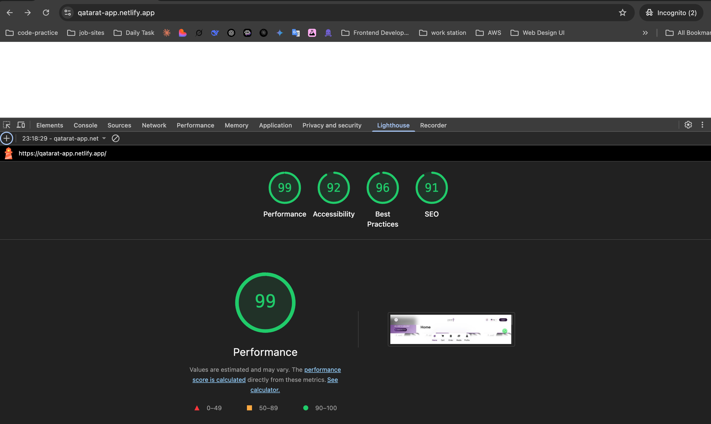

# Qatarat App



_Lighthouse performance audit: 99 Performance, 92 Accessibility, 96 Best Practices, 91 SEO_

A modern, responsive e-commerce web application built with **React**, **TypeScript**, **Vite**, **Redux Toolkit**, **TailwindCSS**, **Swiper**, and **Formik**. The app supports multi-language (i18n), dark/light themes, and a modular component structure.

## Features

- **Product Catalog**: Browse products by category, view product details, and see suggested similar products.
- **Cart Management**: Add, update, and remove products from the cart. View cart summary and proceed to checkout.
- **Internationalization (i18n)**: Switch between English and Arabic.
- **Theme Support**: Light, dark, and system theme modes.
- **Responsive UI**: Mobile-first design with TailwindCSS.
- **Custom Components**: Modular UI components for easy extension.
- **State Management**: Powered by Redux Toolkit and RTK Query for API calls.
- **Form Validation**: Robust forms powered by [Formik](https://formik.org/).
- **Mock API**: Easily switch to real APIs by updating the endpoints.
- **Notifications**: Notification dropdown in the header.
- **Subscriptions**: Premium subscription call-to-action.
- **Swiper Slider**: Interactive homepage slider for featured content.

## Getting Started

### Prerequisites

- Node.js (v16+ recommended)
- npm

### Installation

1. Clone the repository:

   ```sh
   git clone <your-repo-url>
   cd qatarat-app
   ```

2. Install dependencies:

   ```sh
   npm install
   ```

3. Start the development server:

   ```sh
   npm run dev
   ```

4. Open [http://localhost:5173](http://localhost:5173) in your browser.

### Build for Production

```sh
npm run build
```

### Linting

```sh
npm run lint
```

## Project Structure

```
qatarat-app/
  ├── public/                # Static assets (fonts, images, etc.)
  ├── src/
  │   ├── components/        # Reusable UI components
  │   ├── pages/             # Page components (Home, Cart, ProductList, etc.)
  │   ├── store/             # Redux store and slices
  │   ├── routes/            # App routing
  │   ├── language/          # i18n setup
  │   └── assets/            # Static assets for React
  ├── index.html             # App entry point
  ├── tailwind.config.mjs    # TailwindCSS config
  ├── package.json           # Project metadata and scripts
  └── README.md              # Project documentation
```

## Main Pages & Components

- **Home**: Product categories, homepage slider, banner, and WhatsApp contact.
- **Cart**: View, update, and remove cart items; cart summary.
- **Product List**: Products by category.
- **Single Product**: Product details and similar product suggestions.
- **Profile, Order, Media**: Placeholder pages for user profile, order history, and media content.
- **Header/Footer**: Navigation, language switcher, notifications, and cart count.
- **Subscriptions**: Premium subscription call-to-action.

## State Management

- Uses **Redux Toolkit** for state and **RTK Query** for API calls.
- Slices: `themeSlice`, `languageSlice`, `apiSlice`.

## Internationalization

- Configured with **react-i18next**.
- Switch languages using the dropdown in the header.

## Styling

- **TailwindCSS** for utility-first styling.
- Custom fonts via `/public/fonts/style.css`.

## Swiper Integration

- Used for the homepage slider.
- To avoid linter errors, import Swiper CSS as:
  ```js
  import "swiper/css";
  import "swiper/css/pagination";
  ```
  Ensure Swiper is installed:
  ```sh
  npm install swiper
  ```

## Form Validation

- **Formik** is used for building and validating forms. See [Formik documentation](https://formik.org/) for usage details and examples.

## Customization

- Update categories, products, and API endpoints in `apiSlice.ts`.
- Add more languages in `src/language/i18n.ts`.
- Customize theme and styles in `tailwind.config.mjs` and CSS files.
- Build forms easily with Formik for robust validation and UX.

## License

MIT
